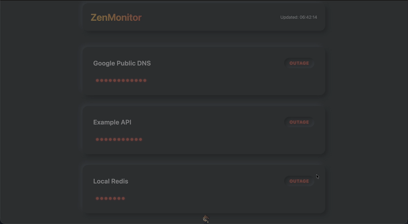

# ZenMonitor 🧘


**ZenMonitor** is a minimalist, self-hosted uptime monitor designed for developers who suffer from "dashboard fatigue." Unlike existing tools that feature complex GUIs and database-stored configurations, ZenMonitor treats **Configuration as Code**.

The entire application state is defined in a single `monitors.yaml` file, making it instantly deployable via Ansible, Terraform, or simple Git cloning. The interface is purely visual: a premium Neumorphic grid of green/red dots representing the last 90 days.



## ✨ Features

- **Configuration as Code**: Single `monitors.yaml` source of truth.
- **Visual Dot Matrix**: GitHub-style activity heat map for uptime history.
- **Lightweight Backend**: Written in Go (Golang), consuming minimal RAM (<20MB).
- **Premium UI**: Neumorphic design with dark mode, smooth animations, and hover tooltips.
- **Notifications**: Integrated support for Telegram and Slack alerts.
- **Docker Ready**: Multi-stage build for a tiny production image.

## 🚀 Quick Start

### 1. Installation

**Using Docker:**
```bash
docker run -d \
  -p 8080:8080 \
  -v $(pwd)/monitors.yaml:/app/monitors.yaml \
  -v zen_data:/app/data \
  github.com/pronzzz/zenmonitor:latest
```

**Running Locally:**
```bash
# Clone the repo
git clone https://github.com/pronzzz/zenmonitor.git
cd zenmonitor

# Install dependencies
go mod tidy

# Run the server
go run cmd/server/main.go
```

Access the dashboard at `http://localhost:8080`.

### 2. Configuration (`monitors.yaml`)

Define your services in a simple YAML file:

```yaml
global:
  check_interval: 60s
  history_days: 90

notifications:
  - type: telegram
    token: "YOUR_BOT_TOKEN"
    chat_id: "YOUR_CHAT_ID"

monitors:
  - name: "Google Public DNS"
    type: "icmp"
    host: "8.8.8.8"
    
  - name: "Production API"
    url: "https://api.myapp.com/health"
    method: "GET"
    expect_status: 200
```

## 🛠 Tech Stack

- **Backend**: Go (Golang) 1.23+
- **Database**: SQLite (Embedded, WAL mode enabled)
- **Frontend**: Vanilla JS + HTMX
- **Styling**: Custom Neumorphic CSS (Dark Mode)

## 🤝 Contributing

Contributions are welcome! Please read `CONTRIBUTING.md` for details on our code of conduct, and the process for submitting pull requests.

## 📄 License

This project is licensed under the MIT License - see the [LICENSE](LICENSE) file for details.
